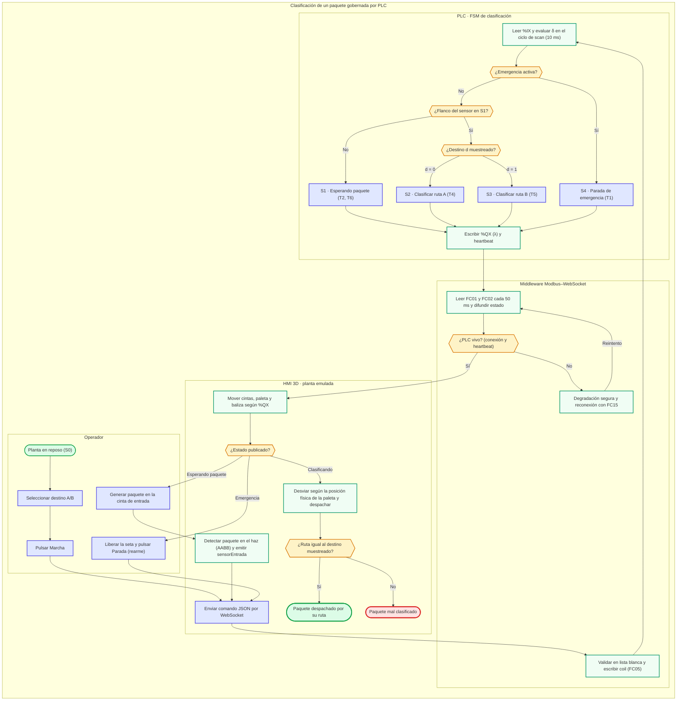

# Diagrama BPMN: Clasificación de un paquete gobernada por PLC

```mermaid
flowchart LR
    subgraph POOL["Clasificación de un paquete gobernada por PLC"]
        subgraph LANE1["Operador"]
            Inicio(["Planta en reposo (S0)"]):::startEvent
            O_Destino["Seleccionar destino A/B"]:::userTask
            O_Marcha["Pulsar Marcha"]:::userTask
            O_Paquete["Generar paquete en la cinta de entrada"]:::userTask
            O_Rearme["Liberar la seta y pulsar Parada (rearme)"]:::userTask
        end
        subgraph LANE2["HMI 3D · planta emulada"]
            H_Comando["Enviar comando JSON por WebSocket"]:::userTask
            H_Animar["Mover cintas, paleta y baliza según %QX"]:::serviceTask
            H_Estado{{"¿Estado publicado?"}}:::gateway
            H_Haz["Detectar paquete en el haz (AABB) y emitir sensorEntrada"]:::serviceTask
            H_Desviar["Desviar según la posición física de la paleta y despachar"]:::serviceTask
            H_Correcto{{"¿Ruta igual al destino muestreado?"}}:::gateway
            Fin_OK(["Paquete despachado por su ruta"]):::endEvent
            Fin_Mal(["Paquete mal clasificado"]):::endError
        end
        subgraph LANE3["Middleware Modbus–WebSocket"]
            M_Escribir["Validar en lista blanca y escribir coil (FC05)"]:::serviceTask
            M_Leer["Leer FC01 y FC02 cada 50 ms y difundir estado"]:::serviceTask
            M_Vivo{{"¿PLC vivo? (conexión y heartbeat)"}}:::gateway
            M_Degradar["Degradación segura y reconexión con FC15"]:::serviceTask
        end
        subgraph LANE4["PLC · FSM de clasificación"]
            P_Leer["Leer %IX y evaluar δ en el ciclo de scan (10 ms)"]:::serviceTask
            P_Emergencia{{"¿Emergencia activa?"}}:::gateway
            P_S4["S4 · Parada de emergencia (T1)"]:::userTask
            P_Flanco{{"¿Flanco del sensor en S1?"}}:::gateway
            P_S1["S1 · Esperando paquete (T2, T6)"]:::userTask
            P_Destino{{"¿Destino d muestreado?"}}:::gateway
            P_S2["S2 · Clasificar ruta A (T4)"]:::userTask
            P_S3["S3 · Clasificar ruta B (T5)"]:::userTask
            P_Salidas["Escribir %QX (λ) y heartbeat"]:::serviceTask
        end
    end
    Inicio --> O_Destino
    O_Destino --> O_Marcha
    O_Marcha --> H_Comando
    H_Comando --> M_Escribir
    M_Escribir --> P_Leer
    P_Leer --> P_Emergencia
    P_Emergencia -->|Sí| P_S4
    P_Emergencia -->|No| P_Flanco
    P_Flanco -->|No| P_S1
    P_Flanco -->|Sí| P_Destino
    P_Destino -->|d = 0| P_S2
    P_Destino -->|d = 1| P_S3
    P_S1 --> P_Salidas
    P_S2 --> P_Salidas
    P_S3 --> P_Salidas
    P_S4 --> P_Salidas
    P_Salidas --> M_Leer
    M_Leer --> M_Vivo
    M_Vivo -->|No| M_Degradar
    M_Degradar -->|Reintento| M_Leer
    M_Vivo -->|Sí| H_Animar
    H_Animar --> H_Estado
    H_Estado -->|Esperando paquete| O_Paquete
    O_Paquete --> H_Haz
    H_Haz --> H_Comando
    H_Estado -->|Clasificando| H_Desviar
    H_Estado -->|Emergencia| O_Rearme
    O_Rearme --> H_Comando
    H_Desviar --> H_Correcto
    H_Correcto -->|Sí| Fin_OK
    H_Correcto -->|No| Fin_Mal
    classDef startEvent fill:#dcfce7,stroke:#16a34a,stroke-width:2px;
    classDef endEvent fill:#dcfce7,stroke:#16a34a,stroke-width:3px;
    classDef endError fill:#fee2e2,stroke:#dc2626,stroke-width:3px;
    classDef userTask fill:#e0e7ff,stroke:#4f46e5,stroke-width:2px;
    classDef serviceTask fill:#f0fdf4,stroke:#059669,stroke-width:2px;
    classDef gateway fill:#fef3c7,stroke:#d97706,stroke-width:2px;
```

[Ver en visor interactivo](visor_bpmn.html)
