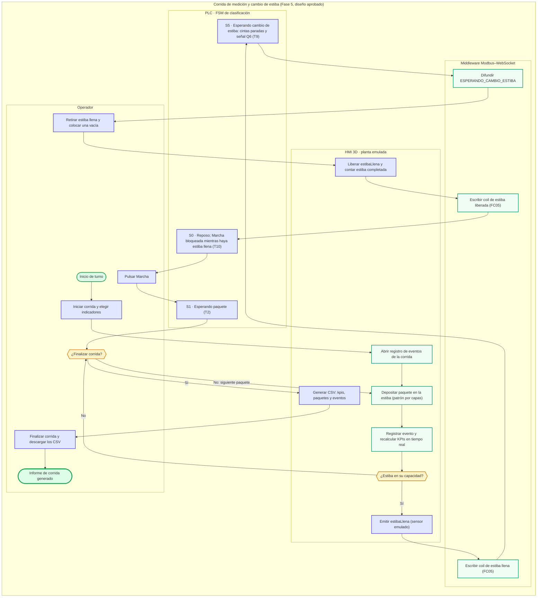

# Diagrama BPMN: Corrida de medición y cambio de estiba (Fase 5, diseño aprobado)

```mermaid
flowchart LR
    subgraph POOL["Corrida de medición y cambio de estiba (Fase 5, diseño aprobado)"]
        subgraph LANE1["Operador"]
            Inicio(["Inicio de turno"]):::startEvent
            O_Corrida["Iniciar corrida y elegir indicadores"]:::userTask
            O_Cambio["Retirar estiba llena y colocar una vacía"]:::userTask
            O_Marcha["Pulsar Marcha"]:::userTask
            O_Fin{{"¿Finalizar corrida?"}}:::gateway
            O_Informe["Finalizar corrida y descargar los CSV"]:::userTask
            Fin(["Informe de corrida generado"]):::endEvent
        end
        subgraph LANE2["HMI 3D · planta emulada"]
            H_Registro["Abrir registro de eventos de la corrida"]:::serviceTask
            H_Depositar["Depositar paquete en la estiba (patrón por capas)"]:::serviceTask
            H_KPI["Registrar evento y recalcular KPIs en tiempo real"]:::serviceTask
            H_Llena{{"¿Estiba en su capacidad?"}}:::gateway
            H_Senal["Emitir estibaLlena (sensor emulado)"]:::userTask
            H_Liberar["Liberar estibaLlena y contar estiba completada"]:::userTask
            H_CSV["Generar CSV: kpis, paquetes y eventos"]:::userTask
        end
        subgraph LANE3["Middleware Modbus–WebSocket"]
            M_Llena["Escribir coil de estiba llena (FC05)"]:::serviceTask
            M_Publicar["Difundir ESPERANDO_CAMBIO_ESTIBA"]:::serviceTask
            M_Liberar["Escribir coil de estiba liberada (FC05)"]:::serviceTask
        end
        subgraph LANE4["PLC · FSM de clasificación"]
            P_S5["S5 · Esperando cambio de estiba: cintas paradas y señal Q6 (T9)"]:::userTask
            P_S0["S0 · Reposo; Marcha bloqueada mientras haya estiba llena (T10)"]:::userTask
            P_S1["S1 · Esperando paquete (T2)"]:::userTask
        end
    end
    Inicio --> O_Corrida
    O_Corrida --> H_Registro
    H_Registro --> H_Depositar
    H_Depositar --> H_KPI
    H_KPI --> H_Llena
    H_Llena -->|No| O_Fin
    H_Llena -->|Sí| H_Senal
    H_Senal --> M_Llena
    M_Llena --> P_S5
    P_S5 --> M_Publicar
    M_Publicar --> O_Cambio
    O_Cambio --> H_Liberar
    H_Liberar --> M_Liberar
    M_Liberar --> P_S0
    P_S0 --> O_Marcha
    O_Marcha --> P_S1
    P_S1 --> O_Fin
    O_Fin -->|No: siguiente paquete| H_Depositar
    O_Fin -->|Sí| H_CSV
    H_CSV --> O_Informe
    O_Informe --> Fin
    classDef startEvent fill:#dcfce7,stroke:#16a34a,stroke-width:2px;
    classDef endEvent fill:#dcfce7,stroke:#16a34a,stroke-width:3px;
    classDef endError fill:#fee2e2,stroke:#dc2626,stroke-width:3px;
    classDef userTask fill:#e0e7ff,stroke:#4f46e5,stroke-width:2px;
    classDef serviceTask fill:#f0fdf4,stroke:#059669,stroke-width:2px;
    classDef gateway fill:#fef3c7,stroke:#d97706,stroke-width:2px;
```

[Ver en visor interactivo](visor_bpmn.html)
